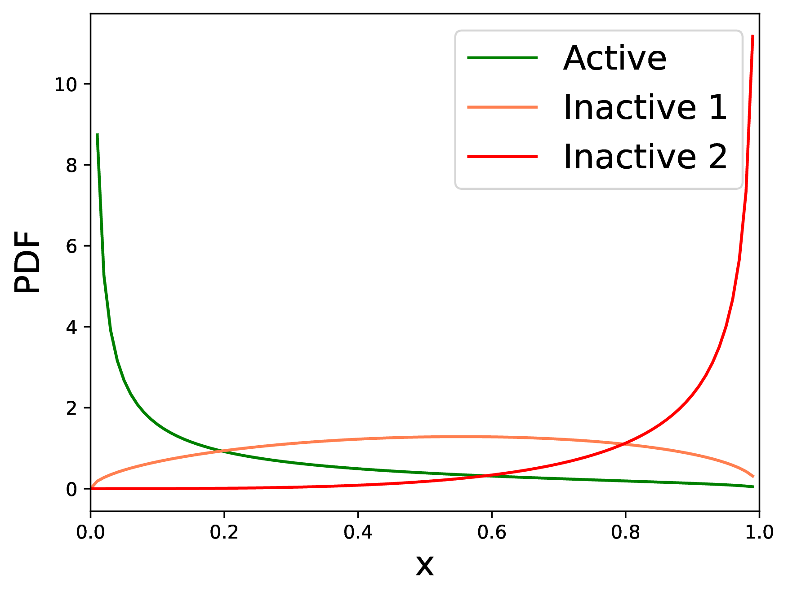
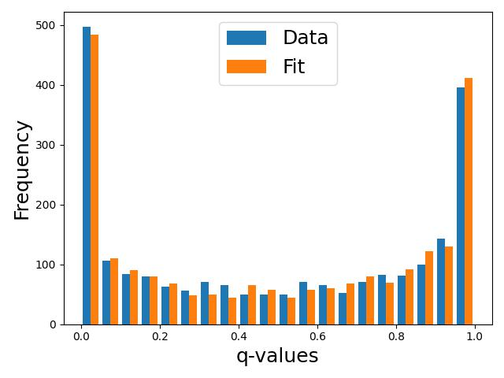
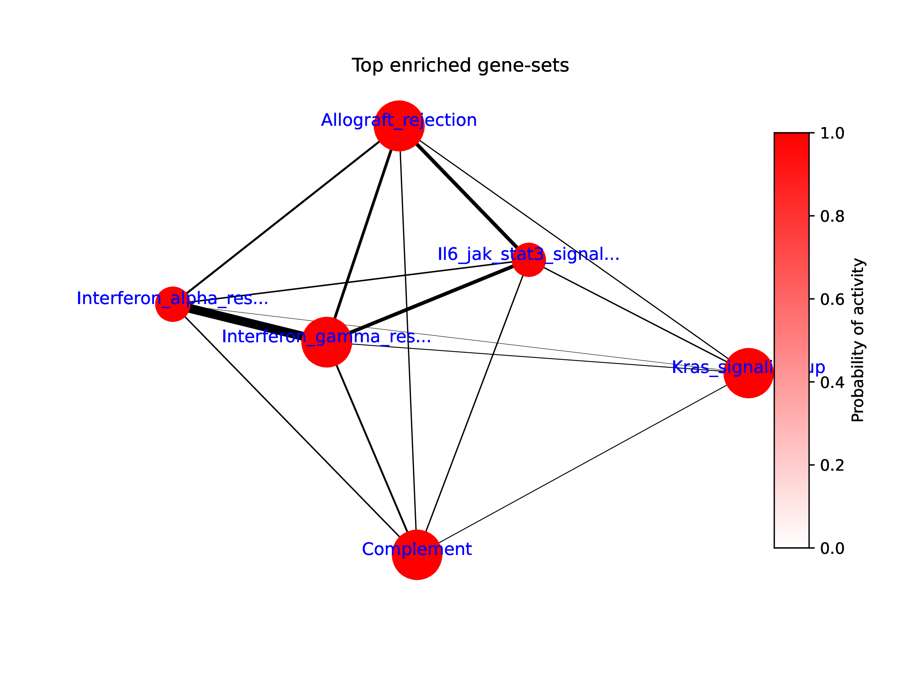
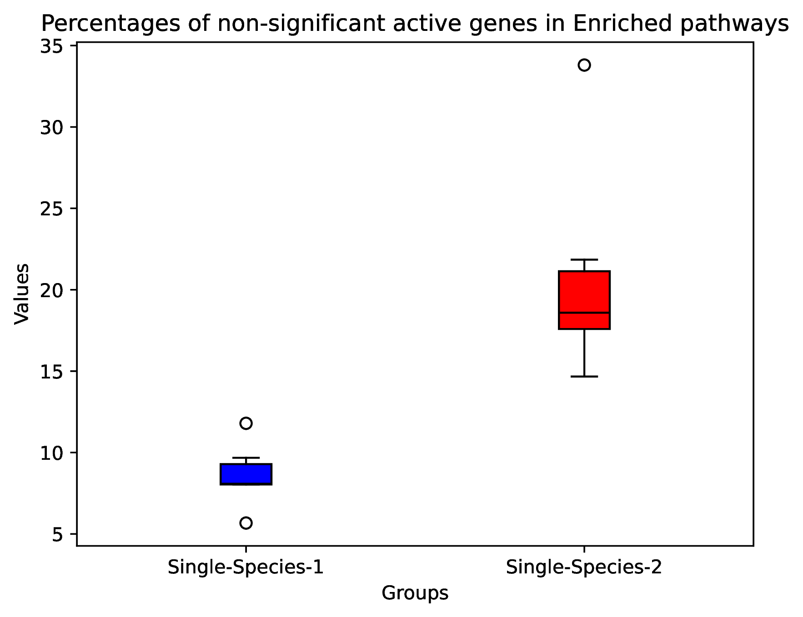
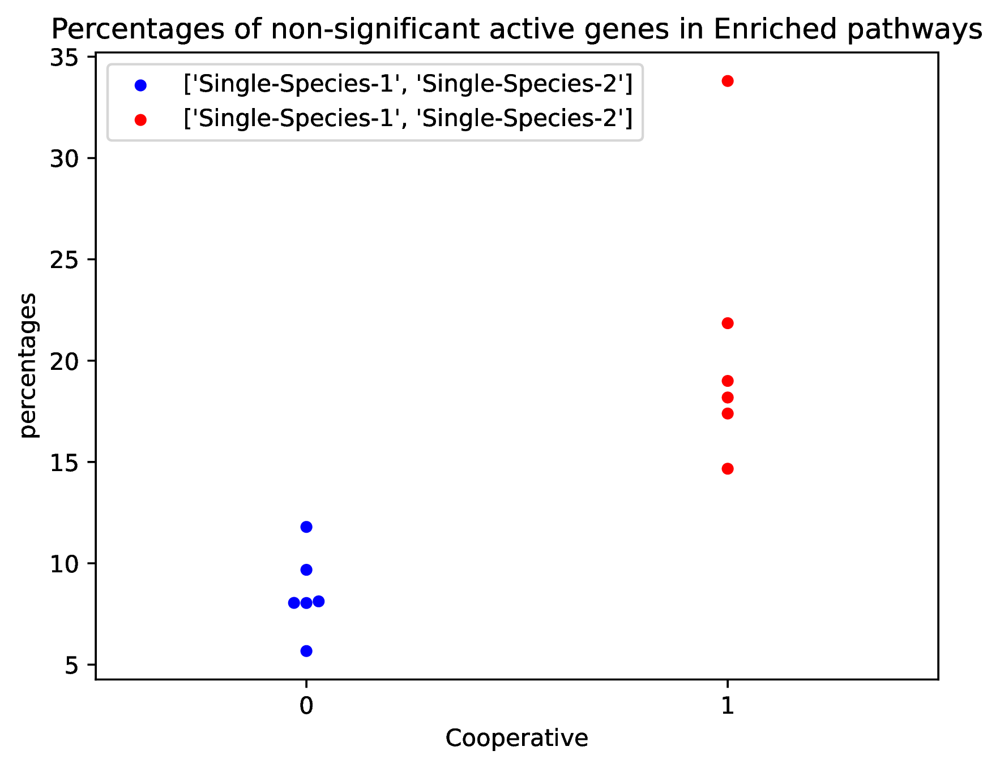

# Results

JOANA operates in two stages:

1. **Parameterization**: In the first stage, it parameterizes the significance scores from Differential Expression Analysis (DEA) using a Beta Mixture Model (BMM).
2. **Inference**: In the second stage, it estimates the probability of pathway activity within a Bayesian Network.

## Results for Step I

JOANA generates a plot demonstrating how the BMM fits the DEA results for each omics type individually.

    

Additionally, it provides a barplot showing the goodness of fit for the observed data.

    

## Results for Step II

### Barplots for Probabilities of Pathway Activity

JOANA offers a PDF containing barplots that display enriched pathways with probabilities exceeding 0.5 for multi-omics (cooperative) data. It also shows pathways for each single-omics modality with probabilities >= 0.5 that do not appear in the multi-omics analysis.

    

It also includes a graph depicting the relationships between pathways. The color of the nodes indicates the probability of pathway activity, the thickness of the edges shows the degree of interconnectedness between pathways (i.e., how many common genes they share), and the size of the nodes reflects the size of the pathways.

    

Furthermore, it provides box plots and beeswarm plots that illustrate the percentage of insignificant active genes (hidden-active genes) in the enriched results.

    

    

